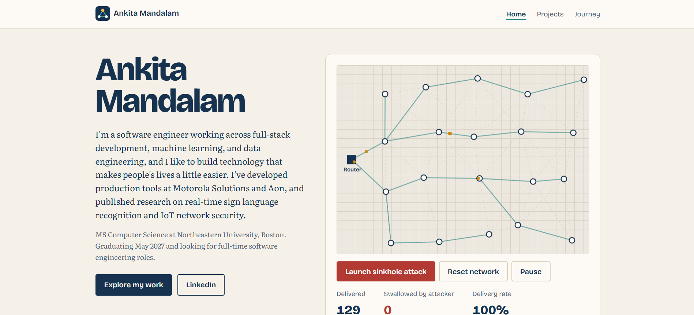
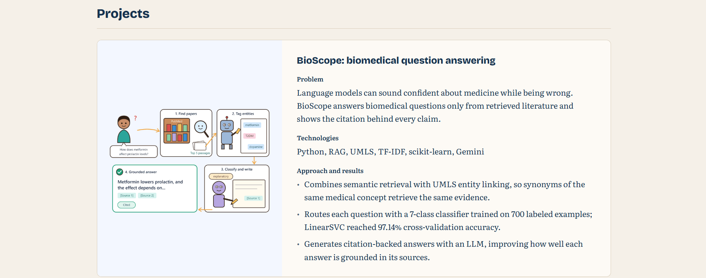
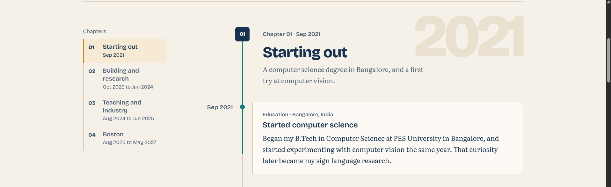

# Ankita Mandalam, Portfolio

A personal portfolio built with vanilla HTML5, CSS3, and ES6 modules. It introduces my work in full-stack engineering, data engineering, and machine learning, presents my two research publications and my projects, and traces the milestones that got me here. It includes an interactive simulation of the RPL sinkhole attack from my IEEE research.

## Author

**Ankita Mandalam**

- GitHub: [ankitam389](https://github.com/ankitam389/)
- LinkedIn: [Ankita Mandalam](https://www.linkedin.com/in/ankitavm/)
- BlueSky: [@ankitamandalam.bsky.social](https://bsky.app/profile/ankitamandalam.bsky.social)

## Class link

[CS 5610 Web Development, Northeastern University](https://johnguerra.co/classes/webDevelopment_online_fall_2025/)

## Project objective

Build a static, front-end only personal portfolio without frameworks, component libraries, jQuery, or a backend. The site should:

- tell recruiters, hiring managers, and researchers who I am and what I am looking for within the first screen;
- show concrete evidence of my work, with technologies and measured results;
- let visitors filter projects by topic;
- include an original, interactive component that sets it apart from other homepages;
- be accessible, W3C valid, linted with the class ESLint configuration, and formatted with Prettier.

## Screenshots

### Home Page



### Projects Page



### Developer Journey Page



## Original component: RPL sinkhole attack simulation

The home page hero is a live simulation of a low-power IoT sensor network running RPL routing. Sensors form a routing tree toward a border router and packets flow along it. Click any sensor, or press **Launch sinkhole attack**, to turn it into a sinkhole that falsely advertises the best route to the router. Neighboring sensors re-route through it and it drops their packets, while live counters show the delivery rate collapsing. **Reset network** restores the healthy tree and **Pause** stops the animation. The animation starts paused for visitors who prefer reduced motion.

It is written from scratch in [`js/modules/meshNetwork.js`](./js/modules/meshNetwork.js): a seeded node layout, breadth-first rank computation, parent selection, packet movement, and canvas rendering. It is a simplified, visual version of the attack I studied in my IEEE paper, _HVSNA: An Advanced Hybrid Attack on RPL-Based Low-Power Wireless Networks_ (IEEE NKCon 2023).

Other JavaScript features: a topic filter on the Projects page that works across both sections and shows a message when a section has no matches, a copy-email button that briefly confirms "Copied", an automatic footer year, and, on the Journey page, a timeline whose axis fills in and whose markers light up as you scroll (it respects reduced-motion settings, and the page is complete without JavaScript).

## Technologies

- HTML5 with semantic elements and meta tags for author, description, and icon
- CSS3 with custom properties, CSS Grid, Flexbox, and media queries
- JavaScript ES6 modules, Canvas 2D API, Clipboard API, and ResizeObserver
- ESLint 9 and Prettier 3 for code quality

## Project structure

```text
ankita-portfolio/
├── index.html
├── projects.html
├── journey.html
├── css/
│   ├── style.css
│   ├── mesh.css
│   └── journey.css
├── js/
│   ├── main.js
│   ├── journey.js
│   └── modules/
│       ├── meshNetwork.js
│       ├── projectFilter.js
│       ├── navigation.js
│       └── footerYear.js
├── images/
│   ├── favicon.png
│   ├── homepage.png
│   ├── journey.png
│   ├── projects.png
│   └── projects/
├── docs/
│   ├── design-document.pdf
│   ├── mockups/
│   └── wireframes/
├── eslint.config.js
├── package.json
├── LICENSE
└── README.md
```

## Instructions to build and run

Requirements: [Node.js](https://nodejs.org/) 18 or newer and npm.

1. Clone the repository:

   ```bash
   git clone https://github.com/ankitam389/ankita-portfolio.git
   cd ankita-portfolio
   ```

2. Install the development dependencies (ESLint, Prettier, and a local static server):

   ```bash
   npm install
   ```

3. Start a local server and open http://127.0.0.1:8080:

   ```bash
   npm start
   ```

   ES6 modules do not load from `file://` URLs, so open the site through a server rather than double-clicking `index.html`.

## Code Quality

```bash
npm run lint          # ESLint with the class configuration
npm run format:check  # Verify Prettier formatting
npm run format        # Apply Prettier formatting
```

All HTML files were validated by W3C and shows that there are no errors and warnings.

## Project resources

- **Live site:** [https://ankitam389.github.io/ankita-portfolio/](https://ankitam389.github.io/ankita-portfolio/)
- **Demo video:** YET TO ADD
- **Design document:** [docs/design-document.md](./docs/design-document.md)

## Use of generative AI

- **Tool:** Claude, by Anthropic (claude.ai)
- **Model:** Claude Opus 5.5
- **Where I used it:**
  - **Home page simulation:** Used Claude to help develop the interactive RPL sinkhole attack simulation on the home page, including the network visualization, packet animation, routing behavior, and attack/reset interactions.
  - **Journey page:** Used Claude to design and develop `journey.html`, the AI-generated page required by the assignment, as a yearbook-inspired timeline of my major milestones and experiences.
  - **Documentation:** Used Claude to refine the README and design document while preserving my original content and ideas.
- **Prompts (summarized):**
  - **Home page simulation:** _"How could I implement an interactive RPL network simulation that visualizes sensor nodes, packet routing, and the effect of a sinkhole attack, while keeping it responsive and accessible?"_
  - **Journey page:** _"Create a visually distinctive Developer Journey page that presents my major milestones as a timeline, with a yearbook-inspired design that feels like flipping through different stages of my journey."_
  - **README:** _"Refine and polish the content of my README.md while preserving my original ideas, structure, and writing style."_

## License

This project is licensed under the [MIT License](./LICENSE).
