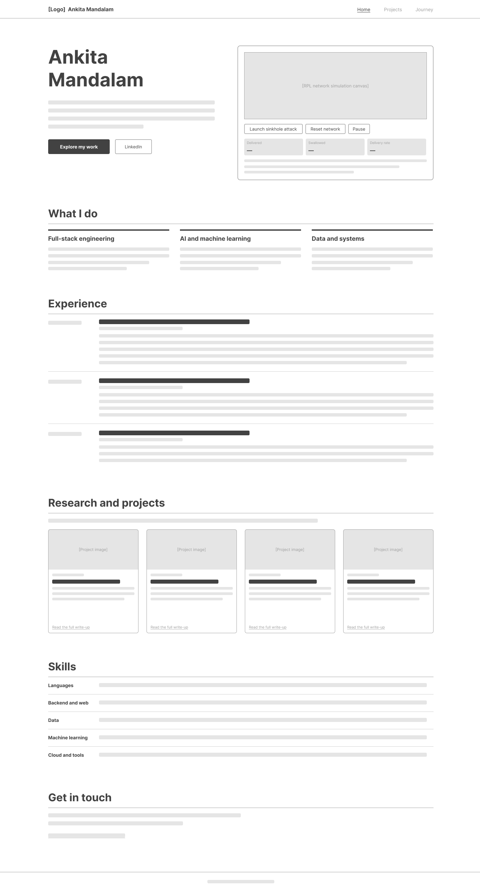
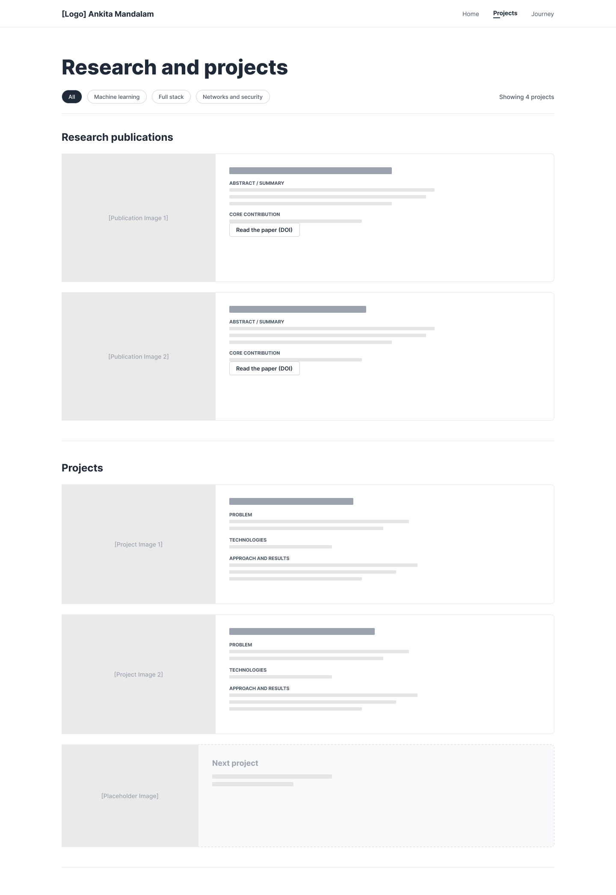
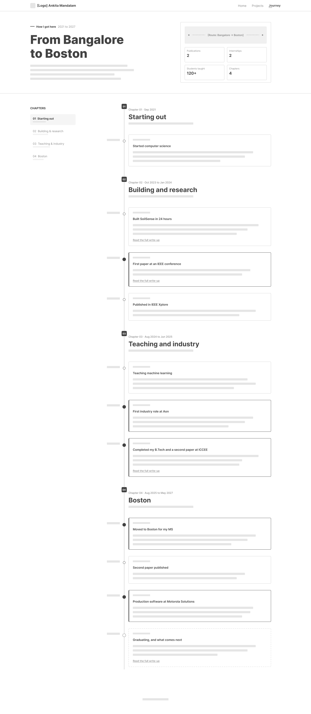
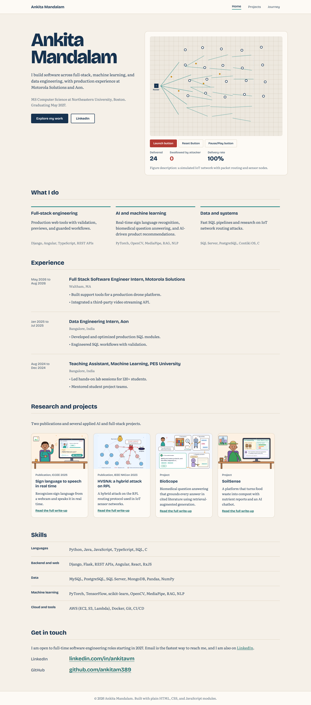
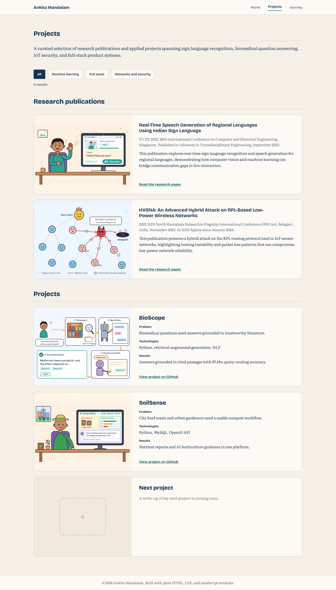
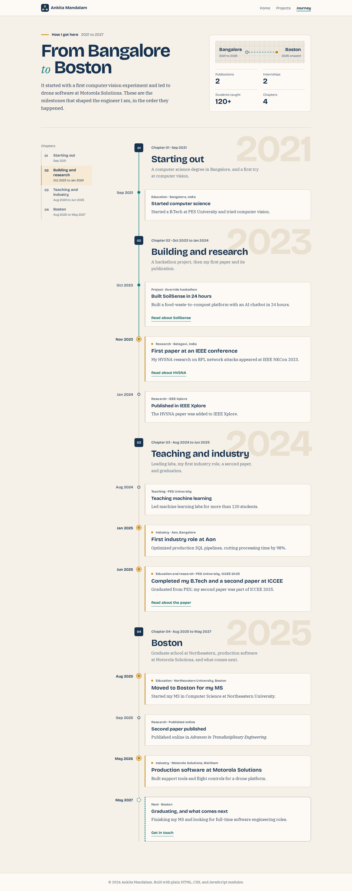

# Design Document

**Project 1: Your personal home page**
Personal Portfolio of Ankita Mandalam

|                |                                                                                               |
| -------------- | --------------------------------------------------------------------------------------------- |
| **Author**     | Ankita Mandalam                                                                               |
| **Course**     | CS 5610 Web Development, Northeastern University                                              |
| **Technology** | Vanilla HTML5, CSS3, and ES6 modules. No frameworks, component libraries, jQuery, or backend. |
| **Pages**      | `index.html` (Home), `projects.html` (Projects), `journey.html` (Journey)                     |

## Contents

1. [Project description](#1-project-description)
2. [User personas](#2-user-personas)
3. [User stories](#3-user-stories)
4. [Wireframes](#4-wireframes)
5. [Design mockups](#5-design-mockups)

## 1. Project description

This project is my personal portfolio: a static, front-end only website that introduces who I am, what I have built, and how I got here. I am an MS Computer Science student at Northeastern University graduating in May 2027. The site is intended as a portfolio for recruiters, hiring managers, engineers, and research contacts to learn about my background and work.

### Problem

A resume provides a concise summary of my experience but does not provide enough space to show the context, process, and technical depth behind my work. My work spans areas that rarely appear together: full-stack engineering at Motorola Solutions, data engineering at Aon, two research publications (IoT network security at IEEE NKCon 2023, and real-time sign language to speech at ICCEE 2025), and applied AI projects such as a biomedical question-answering system and a compost analytics platform with an AI chatbot. Visitors need to grasp this range in one visit, then go deeper into whatever they care about.

### Information architecture: three pages, three questions

| Page                       | Question it answers | Key content and interactions                                                                                                                                                                                                                                                                                                                                                         |
| -------------------------- | ------------------- | ------------------------------------------------------------------------------------------------------------------------------------------------------------------------------------------------------------------------------------------------------------------------------------------------------------------------------------------------------------------------------------ |
| Home (`index.html`)        | Who am I?           | Identity, degree, graduation date, and job target; the interactive RPL simulation; what I do; full work experience (Motorola Solutions, Aon, Machine Learning TA); brief summaries of every project and publication; links to my LinkedIn and GitHub profiles. A visitor who reads only this page should understand my background, current focus, experience, and how to contact me. |
| Projects (`projects.html`) | What have I built?  | Two sections, Research publications and Projects. Each entry covers the problem, what I built, technologies, and results; publications include venue, date, and DOI. Topic filter buttons work across both sections with a live result count.                                                                                                                                        |
| Journey (`journey.html`)   | How did I get here? | A vertical timeline of milestones from 2021 to 2027, grouped into four chapters with a chapter menu: education, first explorations, projects, conferences and publications, teaching, internships, and graduation.                                                                                                                                                                   |

Work experience is kept separate from projects on purpose. Experience lives on Home, because it describes me directly. Projects and publications live on the Projects page, where there is room for technical depth.

### Goals

- Let a recruiter learn my name, degree, graduation date, and job target, and find my contact details, within the first screen.
- Give engineers concrete detail (technologies, numbers, what I owned) to judge the depth of each project.
- Let visitors filter projects by the kind of work they care about: machine learning, full stack, or networks and security.
- Tell the story of my growth on the Journey page, so visitors see a trajectory rather than a list.
- Make the site memorable with one original, interactive element that comes from my own research.
- Work well with keyboards and screen readers, and for people who prefer reduced motion.

### Original component: interactive RPL sinkhole simulation

The Home hero contains a live simulation of a low-power IoT sensor network running RPL, the routing protocol I attacked in my IEEE paper. Sensors form a routing tree toward a border router and packets flow along it. A visitor can click any sensor, or press "Launch sinkhole attack", to turn it into a sinkhole that falsely advertises the best route to the router. Neighboring sensors re-route through it and it silently drops their packets. Live counters show packets delivered, packets swallowed, and the delivery rate collapsing. "Reset network" restores the healthy tree, and "Pause" stops the animation. The simulation is implemented from scratch in JavaScript and visually demonstrates routing, packet movement, and the effect of a sinkhole attack. It turns a paragraph of research into something a non-specialist understands in ten seconds.

### Content inventory

| Type                   | Item                                                                                                                                                                                  | Topic tags                   |
| ---------------------- | ------------------------------------------------------------------------------------------------------------------------------------------------------------------------------------- | ---------------------------- |
| Research publication   | HVSNA: An Advanced Hybrid Attack on RPL-Based Low-Power Wireless Networks. 2023 IEEE NKCon, Belagavi, India, November 2023. DOI 10.1109/NKCon59507.2023.10396649                      | Networks and security        |
| Research publication   | Real-Time Speech Generation of Regional Languages Using Indian Sign Language. ICCEE 2025, Singapore, June 2025; _Advances in Transdisciplinary Engineering_, published September 2025 | Machine learning, Full stack |
| Project                | BioScope: biomedical question answering with retrieval-augmented generation                                                                                                           | Machine learning             |
| Project                | SoilSense: waste-to-compost analytics platform with an AI horticulture chatbot, built in 24 hours at the Override hackathon (October 2023)                                            | Full stack, Machine learning |
| Experience (Home only) | Motorola Solutions, Full Stack Software Engineer Intern, 2026; Aon, Data Engineering Intern, 2025; PES University, Machine Learning Teaching Assistant, 2024                          | Not filtered                 |

### Design Constraints

The site is a static, front-end-only website using vanilla HTML5, CSS3, and ES6 JavaScript. No backend, component libraries, or jQuery are used. The layouts use CSS Grid and Flexbox. The design prioritizes responsive behavior, keyboard accessibility, screen-reader support, and reduced-motion preferences.

## 2. User personas

### Maya Chen, technical recruiter

_34, Boston. Recruits new-grad software engineers for a public-safety technology company._

**Goals**

- Decide in under two minutes whether to move a candidate forward.
- Confirm graduation date, degree, and the kind of role the candidate wants.
- Find a quick way to contact the candidate and see her work.

**Frustrations**

- Portfolio sites that hide the basics behind animations or long intros.
- Broken links and pages that are slow to load.
- Jargon she cannot translate for the hiring manager.

**Context**

- Screens candidates on her laptop between calls, with several tabs open at once.
- Not an engineer, but knows the names of common technologies.

**What she needs from the site**

- Name, degree, graduation date, and job target on the first screen of Home.
- One-click links to my LinkedIn and GitHub profiles.

### David Okafor, engineering manager

_41, Waltham. Leads a full-stack team working in Angular and Django on a real-time operations product._

**Goals**

- Understand what the candidate personally built, not what the team built.
- See evidence of production thinking: validation, error handling, safety checks.
- Go straight to full-stack work and skip the rest.

**Frustrations**

- Skill lists with no evidence behind them.
- Project descriptions without numbers or outcomes.

**Context**

- Reviews candidates on a laptop in the evening, with the resume open in another tab.
- Reads carefully once a candidate passes the first glance.

**What he needs from the site**

- Detailed internship experience on Home.
- A way to filter projects to full-stack work, with technologies and results for each.

### Priya Raman, IoT security researcher

_27, PhD student working on routing security for wireless sensor networks._

**Goals**

- Understand the HVSNA attack quickly and decide whether to cite it or collaborate.
- Find each publication's title, venue, date, and DOI.
- Understand how the candidate's research interests developed.

**Frustrations**

- Research summaries that are either too vague or buried in a PDF.
- Heavy animations that drain battery and cannot be paused.

**Context**

- Navigates mostly with the keyboard and has "reduce motion" turned on in her operating system.

**What she needs from the site**

- A clear explanation of the attack and a link to the full publication.
- A chronological view of research milestones, and controls she can operate by keyboard.

## 3. User stories

Each story describes a real visit from one of the personas, followed by the acceptance criteria the site must meet.

### Story 1: Maya screens me between calls

Maya has five minutes before her next call. She opens the link in my application on her laptop. Before she scrolls, she sees my name, that I am doing an MS in Computer Science at Northeastern graduating in May 2027, and that I am looking for full-time software engineering roles. She has the information she needs to understand my background and decide whether to explore my application further.

**Acceptance criteria**

- The first screen of Home shows name, pitch, degree, graduation date, and job target, without scrolling.
- The hero is the first thing on the page, above the simulation's controls and every other section.

### Story 2: Maya finds how to reach me

Maya wants to add me to her tracking system. She scrolls to "Get in touch," where the page says LinkedIn is the fastest way to reach me. She opens my LinkedIn profile to save it with her notes, and glances at my GitHub to see my code.

**Acceptance criteria**

- Home ends with a "Get in touch" section that says how best to reach me, with labeled links to my LinkedIn and GitHub profiles.
- The links are real <a> elements whose visible text shows where each one goes.
- Neither my email address nor my phone number is published on the public site.

### Story 3: David looks for full-stack work

David opens the Projects page on his laptop and presses "Full stack". Both sections narrow at once: the sign language publication stays under Research publications, SoilSense stays under Projects, and the count reads "Showing 2 results". In SoilSense he reads how I built a Python and MySQL platform with validation at every step, which is the production care his team needs.

**Acceptance criteria**

- Filter buttons for All, Machine learning, Full stack, and Networks and security, built with real `<button>` elements.
- The selected filter is clearly identified, and the result count updates and is announced to screen readers
- A section with no matching entries shows a short message instead of disappearing silently.
- Each entry lists technologies and at least one concrete result.

### Story 4: David checks my experience

Before deciding whether to move forward with my application, David wants to know how recent and relevant my experience is. On Home, the Experience section lists my roles newest first: Motorola Solutions, Aon, and my Machine Learning teaching assistantship. Each shows dates, location, and what I built or led.

**Acceptance criteria**

- Experience is an ordered list, newest first, with role, company, dates, location, and accomplishments.
- Experience appears only on Home and is not mixed with projects.

### Story 5: Priya explores the sinkhole attack

Priya lands on Home and sees a sensor network. Because her system prefers reduced motion, the animation is paused and a message tells her to press Play. She tabs to Play, then to "Launch sinkhole attack". A sensor turns red, most of the network re-routes to it, and the delivery rate falls toward zero. The caption links to HVSNA under Research publications, where she finds the venue, date, and DOI.

**Acceptance criteria**

- The simulation starts paused when `prefers-reduced-motion` is set, and can always be paused.
- Every action is available from buttons; clicking the canvas is a shortcut, not the only way.
- The status message is in an `aria-live` region and the canvas has a text description.
- The caption links to the HVSNA entry on the Projects page.

### Story 6: Priya traces my journey

Curious how a network security researcher ended up building sign language software and drone tools, Priya opens Journey. The timeline runs from starting computer science and exploring computer vision in 2021, through building SoilSense at a 24-hour hackathon and publishing HVSNA at IEEE NKCon in 2023, teaching, industry internships, and a second paper at ICCEE 2025, to graduation in 2027. The publication milestones link to their entries on the Projects page.

**Acceptance criteria**

- Journey shows milestones in chronological order, each with a date, title, and one or two sentences.
- The chronological sequence is clear to screen-reader users.
- Publication and project milestones link to the matching entry on the Projects page.

## 4. Wireframes

### 4.1 Home, Desktop

**Wireframe 1. Home, desktop.** Low-fidelity layout: navigation, a two-column hero with the simulation area and its controls, What I do, Experience, four project cards with their links aligned along the bottom, Skills, and Get in touch with links to my LinkedIn and GitHub profiles.

### 4.2 Projects, Desktop

**Wireframe 2. Projects, desktop.** Low-fidelity layout: the filter buttons and result count, then Research publications and Projects as cards with an image panel on the left and labeled text blocks on the right, and a placeholder card for the next project.

### 4.3 Journey, Desktop

**Wireframe 3. Journey, desktop.** Low-fidelity layout: the hero with the at-a-glance panel, the chapter menu, and one continuous timeline axis with four numbered chapters and eleven milestone cards in three styles: standard, major (filled marker and thicker left edge), and future (dashed).

## 5. Design mockups

These high-fidelity mockups are the visual specification for the implementation. The finished site is based on the information hierarchy, navigation, typography, color system, and primary interactions shown here, with adjustments where needed for browser behavior and accessibility.

### 5.1 Home, Desktop

**Figure 1. Home, desktop.** High-fidelity mockup designed in Figma, showing the navigation with Home selected, the hero with the simulation in its healthy state, What I do, Experience, the research and project cards, Skills, and Get in touch with links to my LinkedIn and GitHub profiles.

### 5.2 Projects, Desktop

**Figure 2. Projects, desktop.** High-fidelity mockup designed in Figma, showing the navigation with Projects selected, the filter buttons with All selected, the result count, and each entry as a boxed card with an image panel on the left and its destination link pinned to the bottom. Publications show venue, date, and DOI; projects show problem, technologies, and results.

### 5.3 Journey, Desktop

**Figure 3. Journey, desktop.** High-fidelity mockup showing the navigation with Journey selected, the hero with the Bangalore-to-Boston panel, the chapter menu, and the timeline in four chapters. Major milestones carry an amber edge and marker, and the final milestone is dashed. The axis is shown filled through the first IEEE paper, illustrating how it fills in as the reader scrolls.
